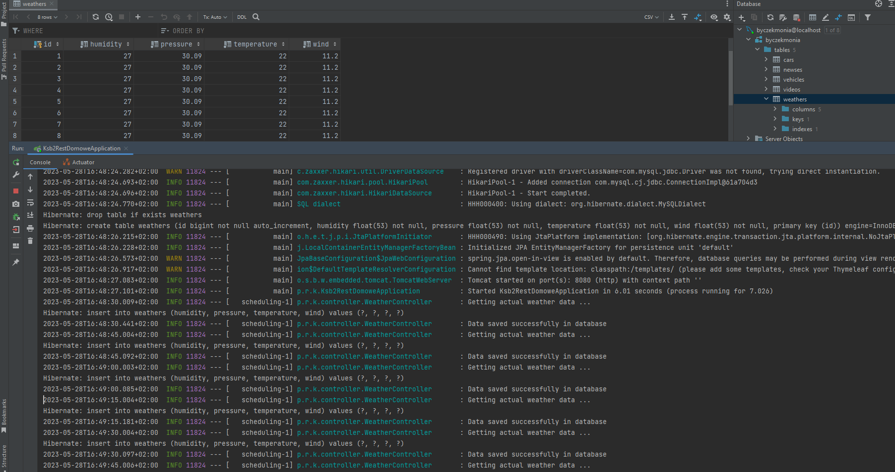

Napisz aplikacje, która łączy się z API pogodowym i co godzinę zapisuje informacje na temat aktualnej temperatury w bazie danych (wykorzystaj Hibernate).

Serwis pogodowy: https://www.weatherapi.com

Więcej o API:  [chce wincyj](https://app.swaggerhub.com/apis-docs/WeatherAPI.com/WeatherAPI/1.0.2-oas3-oas3.1-oas3.1/#/)

Założono konto, dla którego wygenerowany został Api-Key (trial, ważny do 26 maja 2023)

Klucz do API wprowadzono jako finalną zmienną statyczną w kodzie źródłowym

Do stworzenia modelu wykorzystano [to](https://www.jsonschema2pojo.org) :

===================================================

Jak działa apka?

dla testów ustawiono inną wartość cron=*/15 * * * * *

